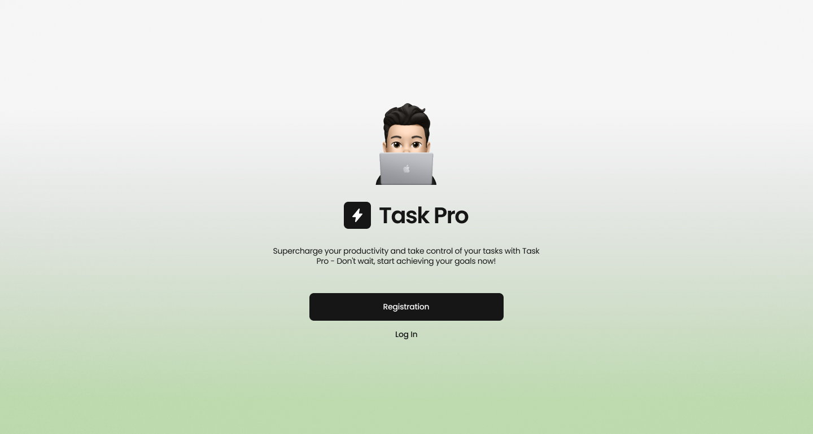
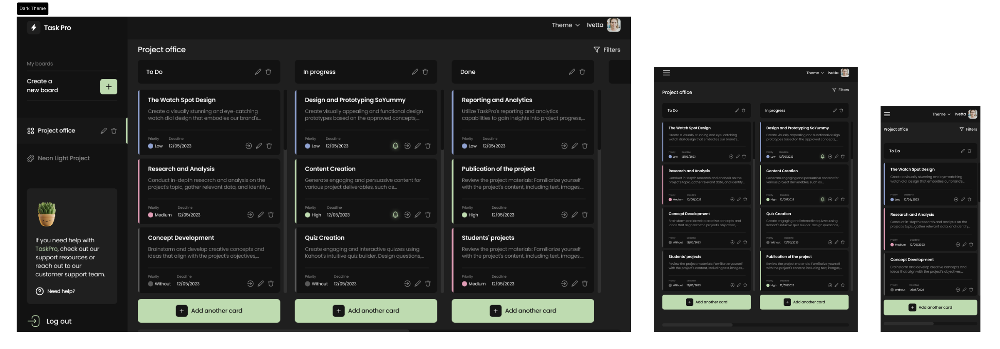
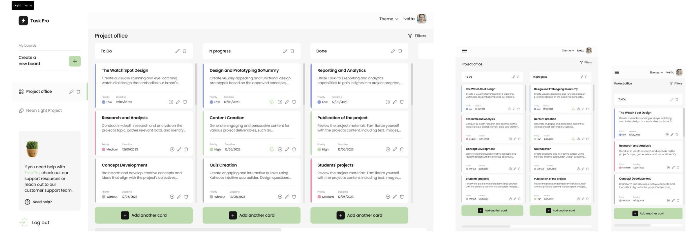

<h1 align="center">
  
</h1>

Supercharge your productivity and take control of your tasks with Task Pro.  Don't wait, start achieving your goals now!

## Introduction

This tool supercharges your productivity and takes control of your tasks.
Before starting your project, it is essential to create a board to visualize and track all the necessary tasks and milestones.
This board serves as a powerful tool to organize the workflow and ensure effective collaboration among team members.

Using this tool you can create a list of dashboards.
Every dashboard has a list of columns and each column contains a list of tasks.
The dashboard might have its own icon and background image.
Every task has a title, description, priority, and deadline field.
There is an easy way to filter tasks by priority and move tasks between columns.
Of course, you can easily delete the data which is not actual anymore.

## Under the hood
- **React**: powerful open-source front-end JavaScript library for building user interfaces based on components.
- **Redux**: for managing and centralizing application state.
- **React Hook Form**: performant, flexible and extensible forms with easy-to-use validation.
- **Styled Components**: CSS-in-JS tool that bridges the gap between components and styling.
- **Adaptive design**: user's interface adapts to different screen sizes.
- **Semantic HTML**: using HTML elements to structure content based on each element's meaning.
- **Dark/Light/Violet mode**: choose the mode which feets best your needs.

## Screenshots

## Demo
This project is deployed on Github pages. Check it out:
[**TaskPro**](https://tim-pashkevych.github.io/goals-achiever-react/welcome)

## Contributors
This project was crafted by a team of developers.
Guys, I am very appreciative of every your commit and your hard work. 
Let's dream and make dreams come true.

    
